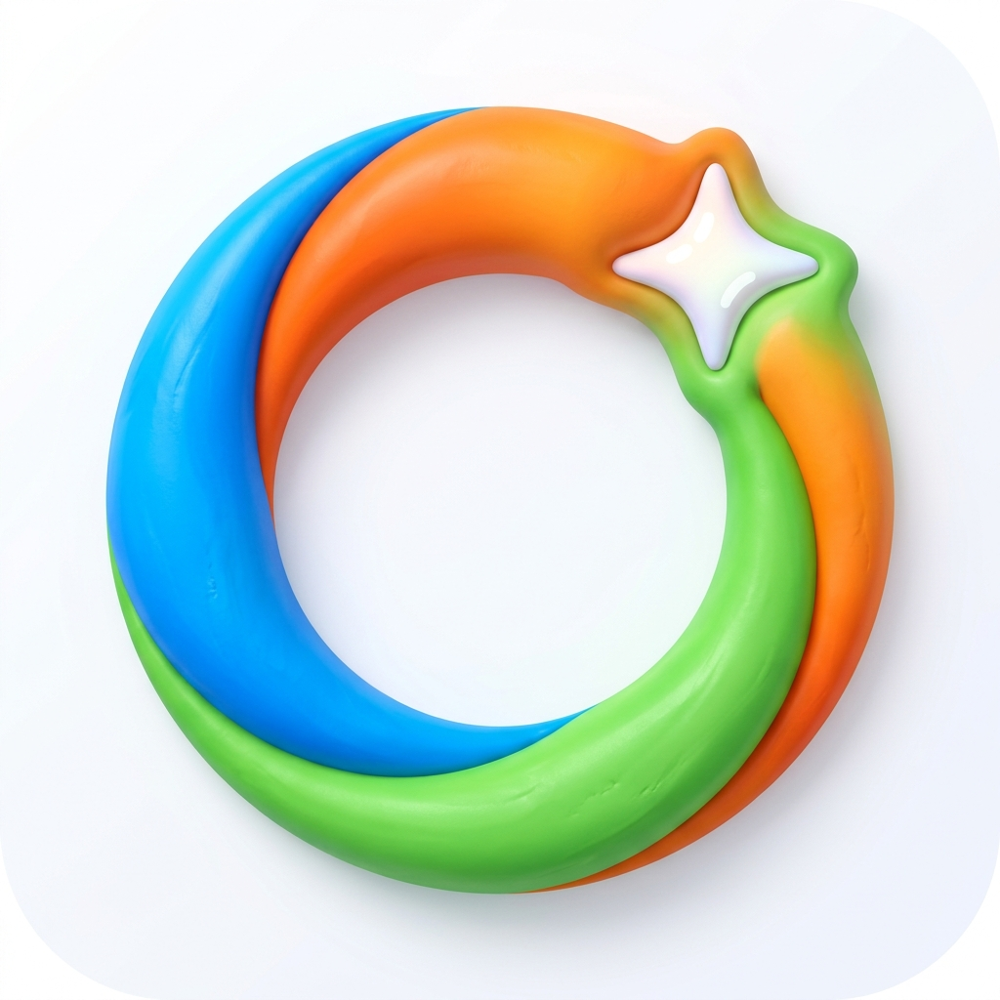
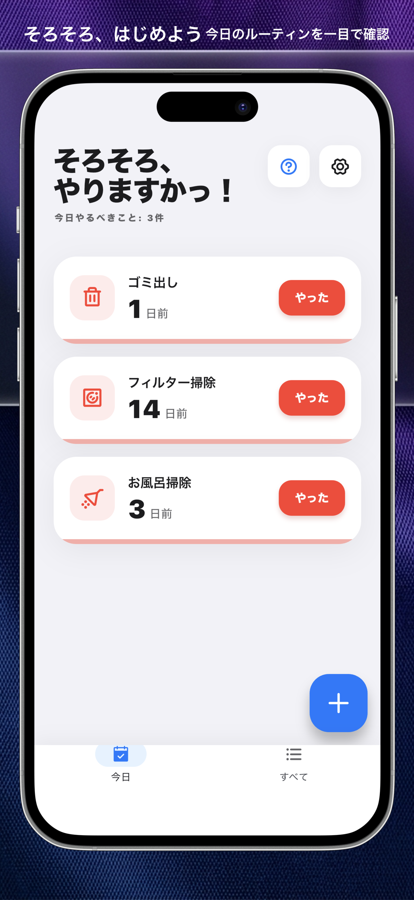
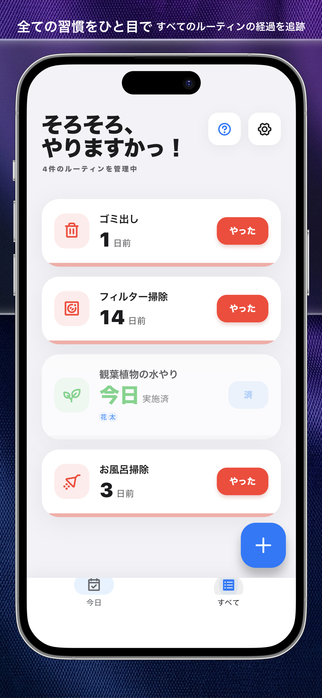
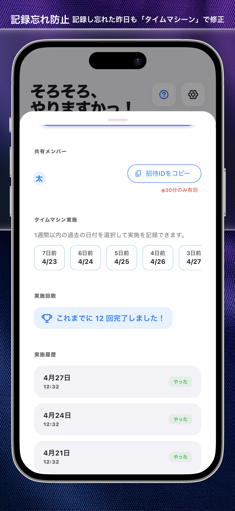

# git-ksk Apps

  

<h2 align="center">そろそろ - ルーティン共有 & 管理</h2>

<b>個人のルーティンワークや家族との家事を管理</b>

「筋トレ、最後にいつやったかな？」「ゴミ出し、そろそろかな？」「仕事の定常作業、忘れてない？」
日々の繰り返されるタスクを、自分一人でも、誰かと一緒でも、心地よく整えます。

### 【主な特徴】
*   **個人でも共有でも**: 筋トレや読書などの個人ルーティンから、家事や育児の共有まで幅広く対応。
*   **「やった」をワンタップ**: 完了記録は即座に同期。共有相手への報告もスムーズです。
*   **適切なタイミングで通知**: 頻度に合わせて「そろそろ」とリマインド。ルーティン化を強力にサポートします。
*   **洗練されたデザイン**: 毎日の記録が楽しくなります。

---

### Screenshots

  
  
  

---

### Download

  

---

### Information
*   [Privacy Policy](https://git-ksk.github.io/sorosoro-privacy/)
*   [Support & Contact](mailto:k.lifetime.app+sorosoro-support@gmail.com)

---
© 2026 git-ksk
